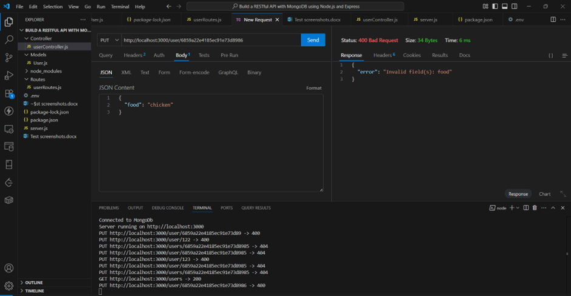

# RESTful API with MongoDB using Node.js and Express

This project is a simple RESTful API for managing users, built using **Node.js**, **Express**, and **MongoDB** (via Mongoose). It follows an MVC architecture, implements schema validation, middleware logging, and supports all CRUD operations with proper error handling.

---

## How to Run the Project

1. **Clone the repository** and open it in your editor.
2. **Install dependencies:**

   ```bash
   npm install
   ```

3. **Create a `.env` file** in the root directory:

   ```env
   MONGO_URI=mongodb://localhost:27017/userdb
   PORT=3000
   ```

4. **Start the server**:

   ```bash
   npm run dev
   ```

5. **Test the endpoints** using ThunderClient or Postman.

---

##  Base URL

```
http://localhost:3000
```

---

##  API Endpoints & Test Results

### 1. GET: Fetch All Users

#### Success

**Request:** `GET /users`

**Response:**


---

### 2. GET: Fetch User by ID

#### Success

**Request:** `GET /users/:id`


#### Error: Invalid ObjectId Format

**Request:** `GET /users/123`


#### Error: User Not Found

**Request:** `GET /users/665fc44a3aa1b3a1d7490000`


---

### 3. POST: Add a New User

#### Success

**Request:** `POST /user`


#### Error: Missing Required Field


#### Error: Duplicate Email


---

### 4. PUT: Update Existing User

#### Success

**Request:** `PUT /user/:id`


#### Error: Invalid ID Format

`PUT /user/123`


#### Error: User Not Found

`PUT /user/665fcabc3aa1b3a1d7490000`


#### Error: Validation (e.g., wrong data type)


#### Error: Unknown Field



---

### 5. DELETE: Remove a User

#### Success

`DELETE /user/:id`


#### Error: Invalid ID Format

`DELETE /user/abc`


#### Error: Not Found

`DELETE /user/665fcabc3aa1b3a1d7490000`


---

## Folder Structure (MVC)

```
project-root/
├── models/
│   └── User.js
├── controllers/
│   └── userController.js
├── routes/
│   └── userRoutes.js
├── screenshots
│   └── images...
├── .env
├── server.js
├── README.md
```

---

## Features Implemented

- Express routing
- MongoDB with Mongoose
- Schema validations
- Error handling
- Middleware logging
- MVC structure
- Full CRUD support
